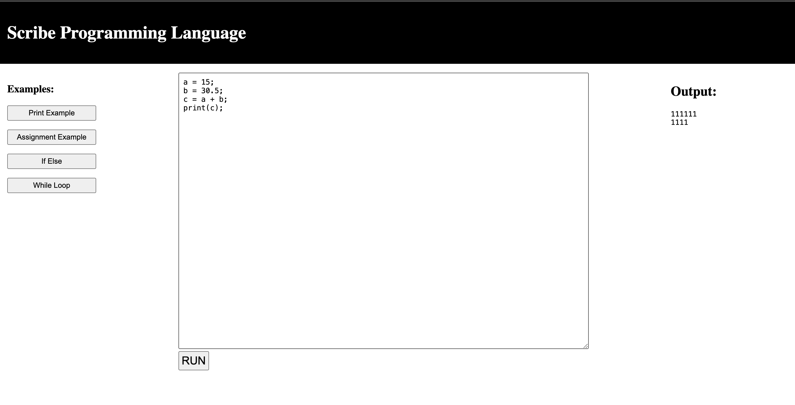
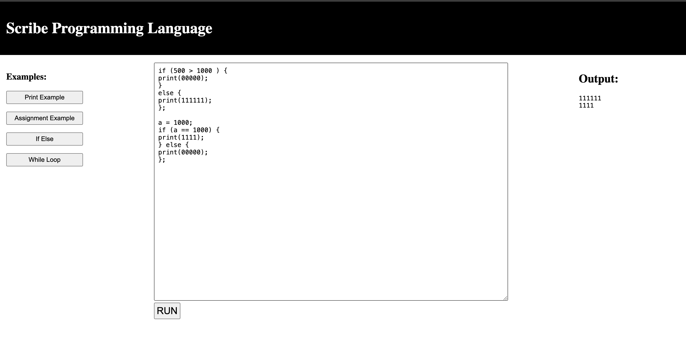

# Scribe Programming Language

Submitted by:
Sunil Prajapati (st124073@ait.asia) (+66 0817373275)

Biraj Koirala (st124371@ait.asia)

### Running the program
Clone the repo using the command:

`git clone git@github.com:scherbatsky-jr/scribe-compiler.git`

Go into project directory:

`cd scribe-compiler`

Install the packages:

`pip install -r requirements.txt`

Run the flask app using the command:

`python main.py`

The app will be running at `http://locolhost:5000`

You can load the examples directly to test the compiler. 

### Screenshots:

Assignment Statement Example:



If Else Statement Example:




# Syntax Documentation for Simple Programming Language

This document outlines the syntax of a simple programming language using Backus-Naur Form (BNF) notation. This language supports basic arithmetic operations, printing, variable assignment, conditionals, and loops.

## Terminals
- `PRINT`: Keyword for printing values.
- `IF`: Keyword for conditional statements.
- `ELSE`: Keyword for the alternative branch of a conditional statement.
- `WHILE`: Keyword for loop statements.
- `PLUS (+)`: Addition operator.
- `MINUS (-)`: Subtraction operator.
- `TIMES (*)`: Multiplication operator.
- `DIVIDE (/)`: Division operator.
- `EQUALS (=)`: Assignment operator.
- `GT`: Greater than comparison operator.
- `GTE`: Greater than or equal to comparison operator.
- `LT`: Less than comparison operator.
- `LTE`: Less than or equal to comparison operator.
- `EQUAL`: Equal comparison operator.
- `NOTEQUAL`: Not equal comparison operator.
- `LPAREN (()`: Left parenthesis.
- `RPAREN ())`: Right parenthesis.
- `LBRACE ({)`: Left brace.
- `RBRACE (})`: Right brace.
- `NUMBER`: Integer or float value.
- `BOOL`: Boolean value (True or False).
- `IDENTIFIER`: Variable name.
- `SEMICOLON (;)`: Statement delimiter.

## Non-terminals
- `program`: Represents the entire program.
- `statement_list`: A list of statements.
- `statement`: Individual statements in the program.
- `expression`: Represents expressions.
- `block`: A block of code enclosed in braces.
- `if_statement`: Conditional statement.
- `while_statement`: Loop statement.
- `relational_expression`: Expressions involving relational operators.
- `print_statement`: Statement for printing values.
- `assignment_statement`: Statement for variable assignment.
- `expression_statement`: Statement consisting of only an expression.
- `expression_identifier`: Expression representing variable access.
- `expression_binary`: Binary expressions involving arithmetic operators.
- `expression_plus`, `expression_minus`, `expression_divide`, `expression_times`: Specific binary operations.
- `expression_paren`: Expression enclosed in parentheses.
- `expression_boolean`: Boolean expressions.
- `term`: Term in an arithmetic expression.
- `factor`: Factor in an arithmetic expression.

## Grammar Rules
1. **Program Structure**

- ```program : statement_list```
2. **Statement Lists**
- ``` statement_list : statement_list statement SEMICOLON | statement SEMICOLON ```

3. **Individual Statements**
- **Print Statement**
  ```
  print_statement : PRINT LPAREN expression RPAREN
  ```

- **Assignment Statement**
  ```
  assignment_statement : IDENTIFIER EQUALS expression
  ```

- **Expression Statement**
  ```
  expression_statement : expression
  ```

- **If Statement**
  ```
  if_statement : IF LPAREN expression RPAREN block
               | IF LPAREN expression RPAREN block ELSE block
  ```

- **While Statement**
  ```
  while_statement : WHILE LPAREN expression RPAREN block
  ```

4. **Expressions**
- **Arithmetic Expressions**
  ```
  expression : expression PLUS expression
             | expression MINUS expression
             | expression TIMES expression
             | expression DIVIDE expression
  ```

- **Relational Expressions**
  ```
  expression : expression GT expression
             | expression GTE expression
             | expression LT expression
             | expression LTE expression
             | expression EQUAL expression
             | expression NOTEQUAL expression
  ```

- **Parenthesized Expressions**
  ```
  expression : LPAREN expression RPAREN
  ```

- **Identifier Expressions**
  ```
  expression : IDENTIFIER
  ```

- **Boolean Expressions**
  ```
  expression : BOOL
  ```


